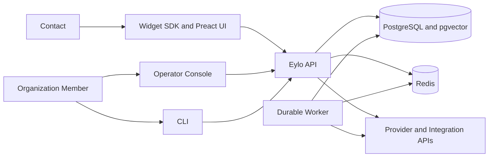
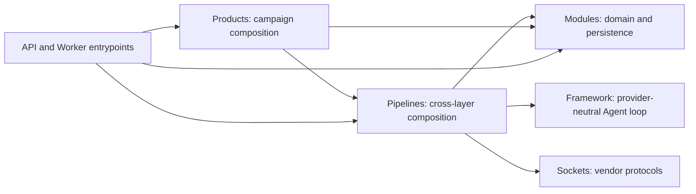
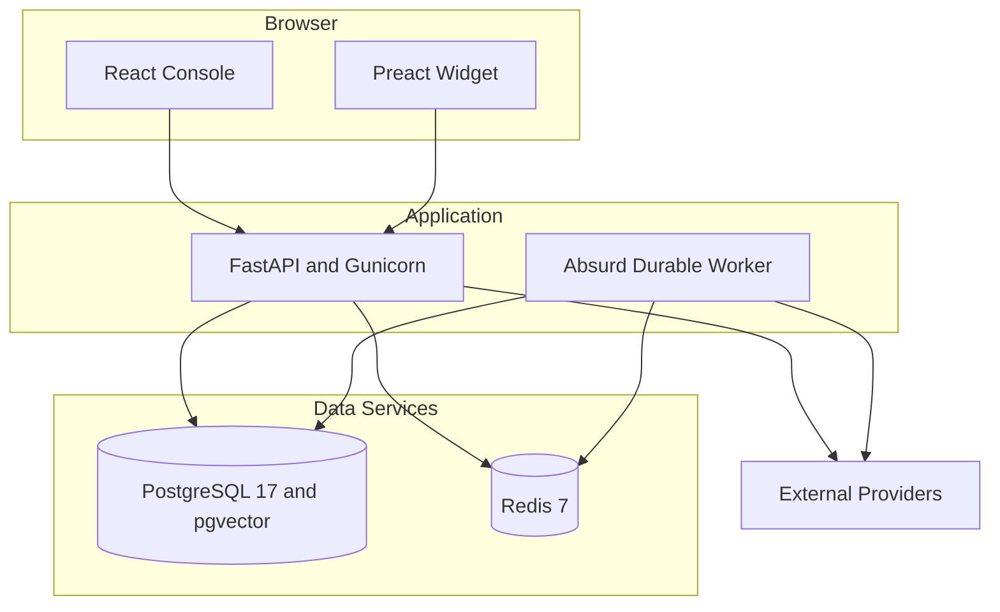
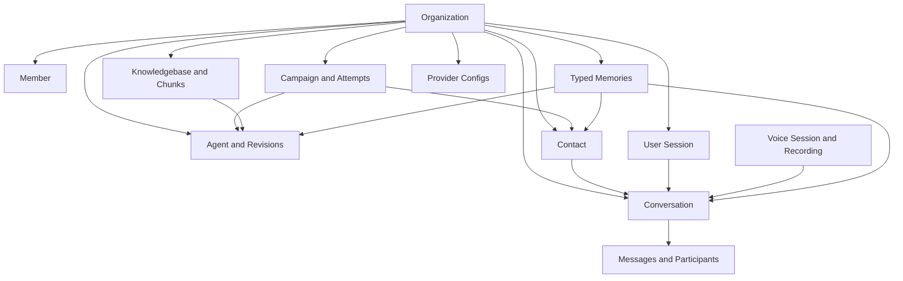

# Architecture diagrams

## System context

The API owns authenticated entrypoints and live transport managers. The worker
owns durable attempts. Both resolve organization authority from PostgreSQL
before contacting a provider.

## Backend dependency direction

Arrows point from a dependent layer to the layer it uses. The enforced negative
rules are the important part: Framework imports no platform; Modules and
Sockets do not import one another.

## Local deployment

## Data ownership

Reference arrows mean association when the target retains independent
ownership. Campaign-to-contact and campaign-to-Agent therefore do not imply
delete cascade.
