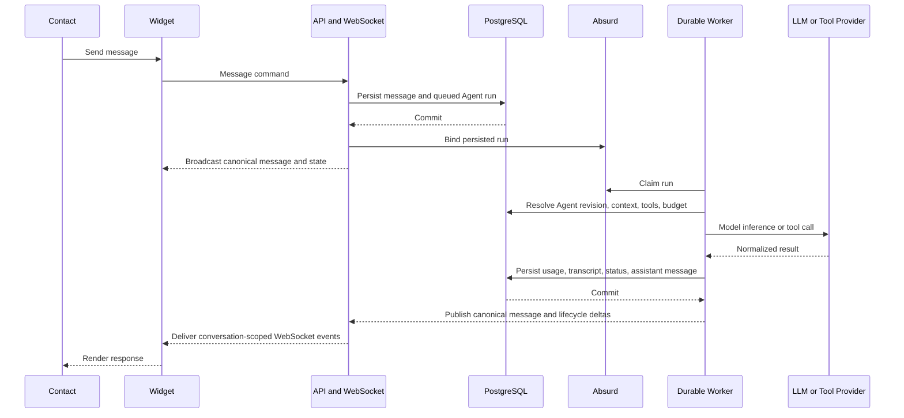
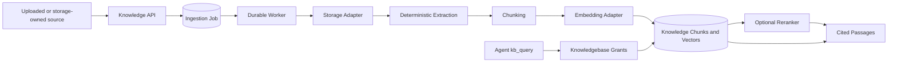
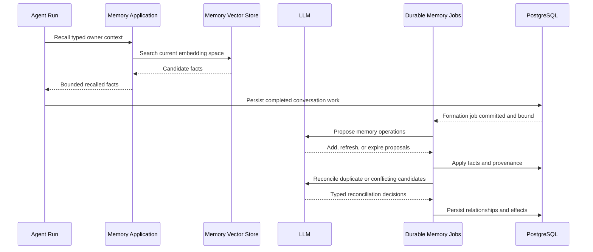
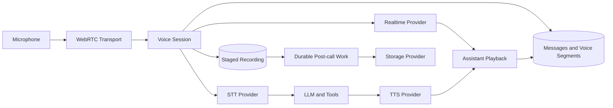
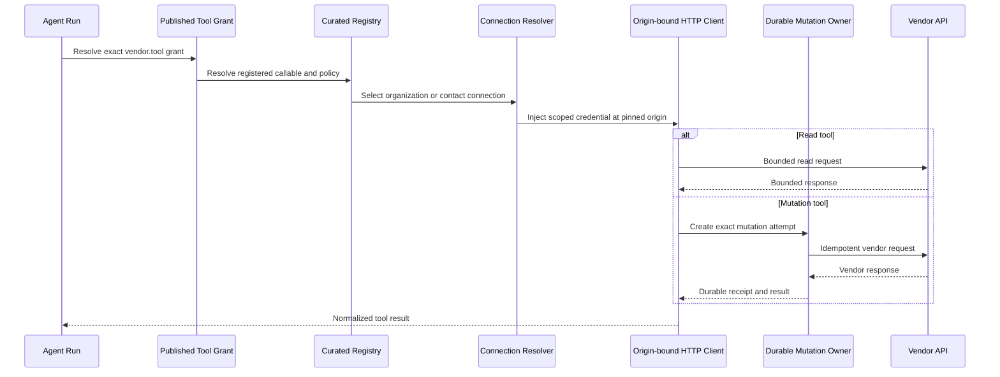
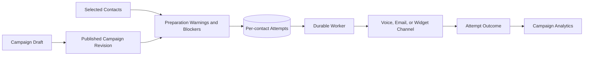

# Data-flow diagrams

## Text conversation and Agent run

## Knowledge ingestion and query

The ingestion job commits before durable execution. Retry replaces chunks for
the same source identity inside the same knowledgebase.

## Memory recall and consolidation

## Browser voice

Only one provider path is active per voice config: realtime, or decomposed
STT/LLM/TTS. Interruption and lifecycle policy wrap either path.

## Curated integration tool call

## Campaign attempt

Preparation warnings may allow V1 outreach; blockers prevent start. Contacts
remain independently owned organization resources.
