# Pipeline data-flow atlas

This page maps every executable unit in the current
[pipeline catalog](../reference/pipelines.md). A pipeline may coordinate domain
modules, the standalone Agent framework, provider sockets, live transports, or
durable work. Helper files and vendor adapters are grouped under the pipeline
that owns their runtime flow.

Read each diagram left to right:

- database cylinders are canonical persisted state;
- provider boxes are external effects reached through a socket adapter;
- a **commit** node marks the boundary before detached or durable work;
- dashed arrows are best-effort delivery, recovery, or observability paths;
- rejection and terminal failure stay visible when the owning pipeline records
  them.

Empty compatibility directories are not runtime pipelines and are not listed.

## Coverage

- Agent runtime: [composition](#process-composition), [Agents](#agents),
  [conversation](#conversation), [LLM](#llm),
  [Agent-run tool binding](#agent-run-tool-command-binding),
  [Agent-run transcript](#agent-run-transcript),
  [parallel Agents](#parallel-agents), [system tools](#system-tools), and
  [MCP](#mcp).
- External systems, Knowledge, and capabilities:
  [curated integrations V2](#curated-integrations-v2),
  [Systems of Record](#systems-of-record), [Knowledgebase](#knowledgebase),
  [Memory](#memory), [embedding](#embedding), [reranking](#reranking),
  [storage](#storage), and [email](#email).
- Voice and transports: [Voice](#voice), [WebRTC](#webrtc),
  [telephony](#telephony), and [WebSocket](#websocket).
- Durable and product execution: [sandbox](#sandbox), [scheduler](#scheduler),
  [Campaign attempts](#campaign-attempt-pipeline),
  [outbound effects](#outbound-effects), [deletions](#deletions),
  [durable events](#durable-events),
  [user-session timeline](#user-session-timeline),
  [Widget development](#widget-development-session), and
  [Widget invitations](#widget-invitations).

## Shared durable-work rule

The durable pipelines below all follow the same ownership rule. The product row
exists before queue binding; a worker reloads authority by ID instead of
carrying a request-scoped ORM object into detached work.

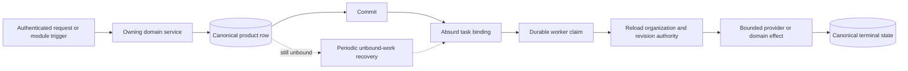

## Agent runtime

### Process composition

`composition.py` registers process-local extensions before either API serving
or worker polling. It does not write product state.

Sources: [`composition.py`](../../server/eylo/pipelines/composition.py),
[`agent_run_worker.py`](../../server/eylo/agent_run_worker.py), and
[`app.py`](../../server/eylo/app.py).

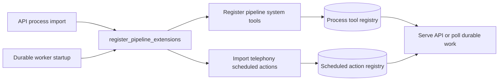

### Agents

The Agent pipeline converts organization-owned definitions into immutable
runtime authority. New work resolves a published revision; existing work
resolves the exact pinned revision. Swarm resolution builds snapshots from the
same Agent resolver.

Sources: [`resolver.py`](../../server/eylo/pipelines/agents/resolver.py),
[`swarm.py`](../../server/eylo/pipelines/agents/swarm.py), and
[`config_deletion.py`](../../server/eylo/pipelines/agents/config_deletion.py).

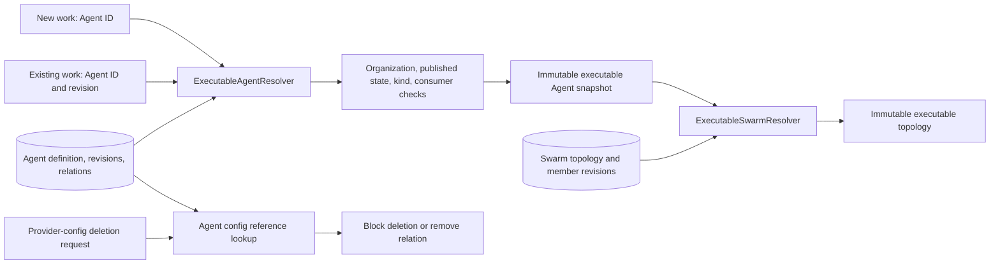

### Conversation

A text turn is message-backed durable work. The request commits the user message
and queued Agent run first. The worker then reloads the exact conversation,
Agent revision, tools, memory, knowledge, and budget authority before invoking
the framework.

Sources: [`start.py`](../../server/eylo/pipelines/conversation/start.py),
[`durable_execution.py`](../../server/eylo/pipelines/conversation/durable_execution.py),
[`context.py`](../../server/eylo/pipelines/conversation/context.py), and
[`conversation_runner.py`](../../server/eylo/pipelines/conversation/conversation_runner.py).

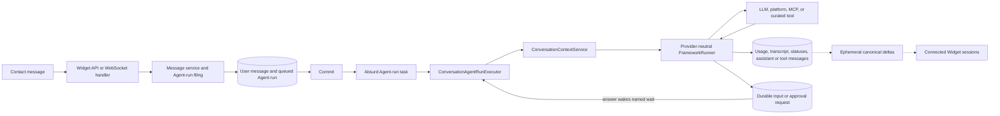

Invalid origin, stale authority, budget exhaustion, and terminal framework
failure converge the Agent run and its message state instead of publishing a
partial success.

### LLM

The LLM pipeline resolves one explicit provider config into a socket adapter.
It also owns first-party title/context-summary work and streams decomposed
voice text into TTS without changing the Agent framework contract.

Sources: [`runtime.py`](../../server/eylo/pipelines/llm/runtime.py),
[`streaming_tts.py`](../../server/eylo/pipelines/llm/streaming_tts.py), and
[`background_agents`](../../server/eylo/pipelines/llm/background_agents/).

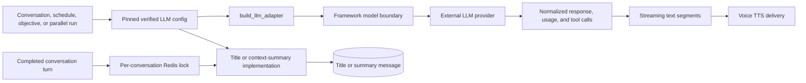

### Agent-run tool command binding

Non-conversation Agent runs do not have conversation tool-use messages. This
pipeline binds each framework call ID to an already persisted transcript
command row so durable tool adapters still have one stable product owner.

Source: [`agent_run_tools.py`](../../server/eylo/pipelines/agent_run_tools.py).

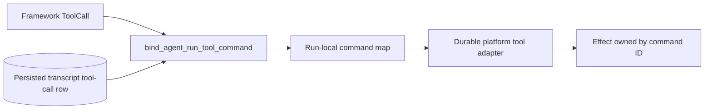

### Agent-run transcript

Scheduled and objective runs persist a private replay transcript because they
do not own conversation messages. Unresolved tool calls replay once after a
worker retry; correlation IDs prevent the same command/result from being
recorded with different content.

Source: [`agent_run_transcript.py`](../../server/eylo/pipelines/agent_run_transcript.py).

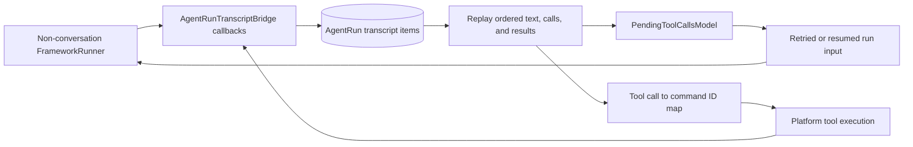

### Parallel Agents

Parallel LLM tasks, swarm members, and attached background Agents share the
same SYSTEM/TASK message plus Agent-run substrate. A task is committed before
spawn; the ordinary Agent-run outbox recovers a failed immediate bind.

Sources: [`task_dispatcher.py`](../../server/eylo/pipelines/parallel_agents/task_dispatcher.py),
[`durable_execution.py`](../../server/eylo/pipelines/parallel_agents/durable_execution.py),
and the three worker implementations in
[`parallel_agents`](../../server/eylo/pipelines/parallel_agents/).

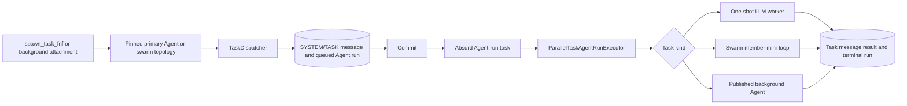

### System tools

Registration makes first-party tools discoverable; assignment alone does not
make them callable. Every turn refreshes organization provider readiness,
Agent bindings, and runtime facts before unavailable tools are filtered out.

Sources: [`registration.py`](../../server/eylo/pipelines/system_tools/registration.py),
[`availability.py`](../../server/eylo/pipelines/system_tools/availability.py),
and [`agent_capabilities.py`](../../server/eylo/pipelines/system_tools/agent_capabilities.py).

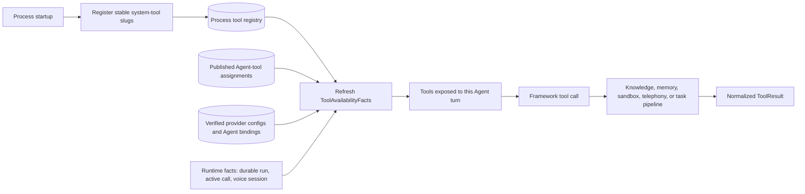

### MCP

MCP server definitions remain organization-owned. Discovery uses the safe MCP
socket to synchronize callable contracts. Execution rechecks the exact Agent
grant; reads are bounded calls, while mutations use the shared durable outbound
receipt boundary.

Sources: [`tools.py`](../../server/eylo/pipelines/mcp/tools.py),
[`tool_execution.py`](../../server/eylo/pipelines/mcp/tool_execution.py), and
[`execution.py`](../../server/eylo/pipelines/mcp/execution.py).

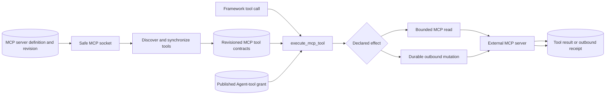

## External systems, knowledge, memory, and provider capabilities

### Curated integrations V2

An installation enables selected registry tools for an organization. A
connection carries organization- or contact-owned credentials. A published
Agent grants individual tools, not the whole installation. Execution resolves
policy and credentials before constructing an origin-pinned client.

Sources: [`registry.py`](../../server/eylo/pipelines/integrations_v2/registry.py),
[`oauth.py`](../../server/eylo/pipelines/integrations_v2/oauth.py),
[`resolution.py`](../../server/eylo/pipelines/integrations_v2/resolution.py), and
[`execution.py`](../../server/eylo/pipelines/integrations_v2/execution.py).

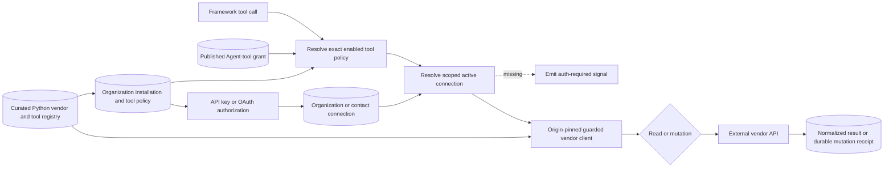

OAuth state is consumed before token exchange so a later provider failure
cannot make the authorization code replayable. Expiring tokens are refreshed
by periodic durable work, not inside an Agent's request budget.

### Systems of Record

The SOR runtime keeps vendor adapters behind canonical profile contracts.
Onboarding commits a source, immutable discovery, mapping, streams, and sync
work. Agent reads use the projection; mutations use a durable command whose
terminal receipt resumes the waiting Agent run.

Sources: [`sync.py`](../../server/eylo/sor/runtime/sync.py),
[`commands.py`](../../server/eylo/sor/runtime/commands.py),
[`revocation.py`](../../server/eylo/sor/runtime/revocation.py),
[`tool_execution.py`](../../server/eylo/pipelines/sor/tool_execution.py), and
[`reads.py`](../../server/eylo/sor/shared/reads.py).

```mermaid
flowchart LR
    source["Verified Source and Published Mapping"]
    generation[(Sync Generation and Stream Runs)]
    commit[Commit]
    roots[Runnable Root Streams]
    waiting[Waiting Dependent Streams]
    worker[Absurd SOR Worker]
    adapter[Profile Vendor Adapter]
    vendor[External System]
    fetched[Immutable Source Payload]
    mapped[Typed Profile Payload]
    page_tx["Bounded Page Write Transaction"]
    coordinate_tx["Generation Coordination Transaction"]
    generation_repair["Post-commit Generation Repair"]
    projection[(Canonical Projection)]
    intents[(Relationship Intents)]
    resolver[Exact Endpoint Resolver]
    local_event["Post-commit SOR lifecycle event"]
    action_event[(Organization-visible action event)]
    grid["SOR Grid and Detail API"]
    model_call["Agent Profile Tool Call"]
    authority["Published Tool and Source Grants"]
    effect{Read or Mutation}
    typed_command["Typed Profile Command Payload"]
    command[(Command Receipt)]
    wait["Durable Agent Wait"]
    recheck["Live Connection, Source, Run, Tool, and Grant Recheck"]
    revoke["Connection or Source-grant Revocation"]
    fence[("Persisted Source and Command Fence")]
    cancel["Exact Absurd Task Cancellation"]
    recovery["Periodic Fenced-work Recovery"]

    source --> generation --> commit
    commit --> roots --> worker --> recheck --> adapter --> vendor
    commit --> waiting
    vendor -->|"No DB transaction"| adapter --> fetched --> mapped --> page_tx --> projection
    projection --> coordinate_tx -->|"parent succeeds"| waiting --> worker
    generation_repair -.-> coordinate_tx
    projection --> intents --> resolver --> grid
    projection --> resolver
    projection -. "after commit" .-> local_event
    model_call --> authority --> effect
    effect -->|read| projection
    effect -->|mutation| typed_command -->|"Encrypted JSON boundary"| command --> commit --> worker
    command --> wait
    worker --> command --> action_event
    command --> wait
    revoke --> fence --> cancel -.-> worker
    fence -.-> recovery -.-> cancel
```

Projection never causes an outbound mutation. A command is keyed by Agent run
and tool call, checkpoints the vendor result, then performs read-after-write.
This separates source synchronization from Agent mutation and prevents a
source-to-Eylo projection from bouncing back to the source.
The DB fence commits before cancellation. Recovery refuses to respawn work for
an ineligible source and periodically stops any task stranded by a process
failure between commit and cancellation.

### Knowledgebase

Knowledge writes and reads retain both organization and knowledgebase identity.
Ingestion commits a job before durable execution. Query checks the Agent's
grant and returns cited passages; optional reranking never widens the selected
knowledgebases.

Sources: [`durable_execution.py`](../../server/eylo/pipelines/knowledgebase/durable_execution.py),
[`query.py`](../../server/eylo/pipelines/knowledgebase/query.py),
[`conversation_files.py`](../../server/eylo/pipelines/knowledgebase/conversation_files.py),
and [`reindex_durable_execution.py`](../../server/eylo/pipelines/knowledgebase/reindex_durable_execution.py).

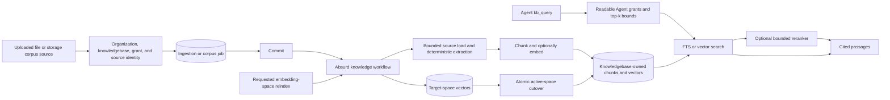

Conversation files use the conversation ID as an ordinary conversation-scoped
knowledgebase. The contact chooses a file, never an internal destination.

### Memory

Memory authority is a typed owner: Agent, contact, or conversation. Live tools
and recall use that owner plus the configured memory/embedding revisions.
Formation, reconciliation, and reindexing are persisted background work.

Sources: [`application.py`](../../server/eylo/pipelines/memory/application.py),
[`hooks.py`](../../server/eylo/pipelines/memory/hooks.py),
[`durable_execution.py`](../../server/eylo/pipelines/memory/durable_execution.py),
[`reconciliation_durable_execution.py`](../../server/eylo/pipelines/memory/reconciliation_durable_execution.py),
and [`reindex_durable_execution.py`](../../server/eylo/pipelines/memory/reindex_durable_execution.py).

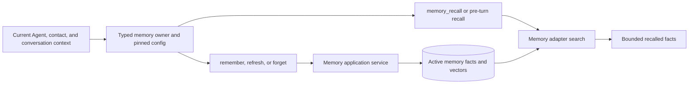

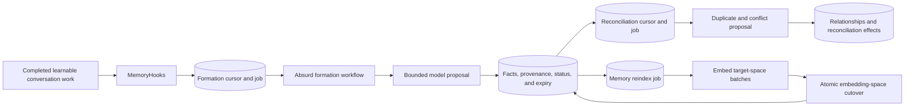

### Embedding

Embedding configs are explicit, verified, revisioned vector-space authority.
The pipeline converts the domain config into a socket adapter and blocks
deletion while knowledge or memory still references it.

Sources: [`config_verification.py`](../../server/eylo/pipelines/embedding/config_verification.py),
[`resolver.py`](../../server/eylo/pipelines/embedding/resolver.py), and
[`config_deletion.py`](../../server/eylo/pipelines/embedding/config_deletion.py).

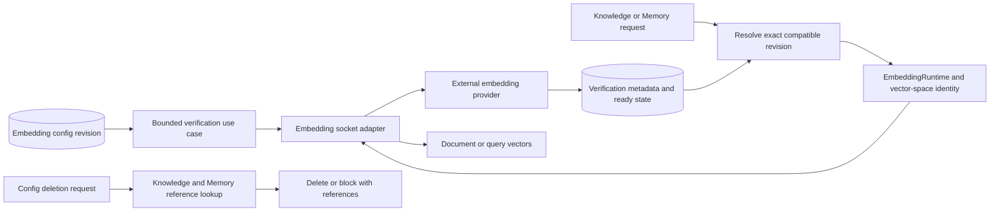

### Reranking

Reranking is an optional, bounded retrieval stage. The caller names a verified
config; the pipeline resolves the exact adapter and returns either ordered
items or an explicit degraded/failure outcome.

Sources: [`config_verification.py`](../../server/eylo/pipelines/reranking/config_verification.py),
[`resolver.py`](../../server/eylo/pipelines/reranking/resolver.py), and
[`application.py`](../../server/eylo/pipelines/reranking/application.py).

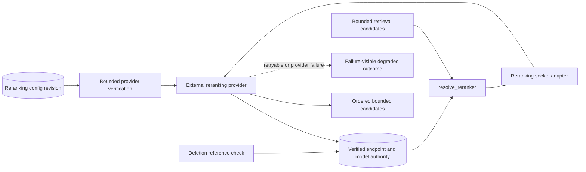

### Storage

Storage configs identify a provider, revision, and operator-owned root. The
pipeline resolves current authority for new writes or pinned historical
authority for reads/deletes. Callers receive an adapter, never permission to
invent final object keys.

Sources: [`config_verification.py`](../../server/eylo/pipelines/storage/config_verification.py),
[`runtime.py`](../../server/eylo/pipelines/storage/runtime.py), and
[`config_deletion.py`](../../server/eylo/pipelines/storage/config_deletion.py).

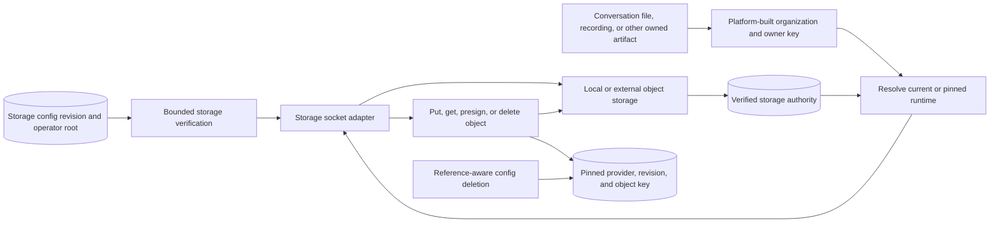

### Email

Email can be invoked by an Agent tool or a campaign channel. Both paths require
an exact organization-owned config and use the durable outbound boundary so a
mutation has one send owner and one receipt.

Sources: [`config_verification.py`](../../server/eylo/pipelines/email/config_verification.py),
[`delivery.py`](../../server/eylo/pipelines/email/delivery.py), and
[`tool_execution.py`](../../server/eylo/pipelines/email/tool_execution.py).

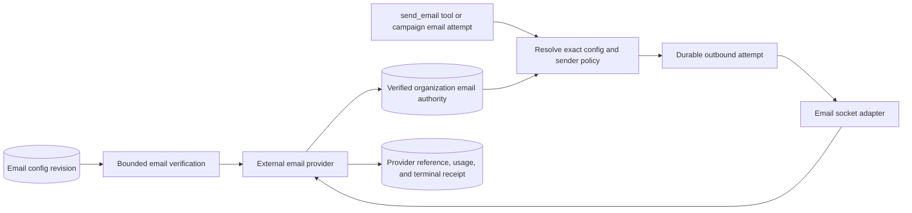

## Voice and live transports

### Voice

A reusable Voice Config combines platform policy with explicit STT/TTS or
realtime provider revisions. The primary Agent's binding is pinned when the
conversation starts and remains authoritative across swarm handoffs.

Sources: [`configuration.py`](../../server/eylo/pipelines/voice/configuration.py),
[`provider_runtime.py`](../../server/eylo/pipelines/voice/provider_runtime.py),
and [`capabilities.py`](../../server/eylo/pipelines/voice/capabilities.py).

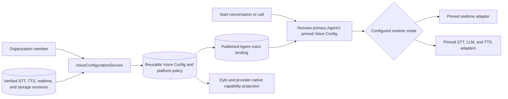

The live pipeline owns turn state, interruption, silence, policy speech,
canonical transcript projection, recording, and cleanup around either provider
mode.

Sources: [`browser.py`](../../server/eylo/pipelines/voice/browser.py),
[`live_runner.py`](../../server/eylo/pipelines/voice/live_runner.py),
[`realtime.py`](../../server/eylo/pipelines/voice/realtime.py),
[`post_call.py`](../../server/eylo/pipelines/voice/post_call.py), and
[`recording_durable_execution.py`](../../server/eylo/pipelines/voice/recording_durable_execution.py).

```mermaid
flowchart LR
    audio["Browser or telephony user audio"]
    session["Voice session with pinned authority"]
    activity["Activity gate and interaction state"]
    mode{"Voice runtime mode"}
    realtime["Realtime provider event loop"]
    stt["STT final utterance"]
    live_runner["LiveVoiceTurnRunner and Agent tools"]
    tts["Streaming TTS"]
    playback["Transport playback gate"]
    live_buffer[("Ordered live voice buffer")]
    interruption["Interruption, silence, max-duration, or end-call policy"]
    terminal["Idempotent voice teardown"]
    transcript[("Canonical messages and voice segments")]
    recording[("Recording upload job")]
    storage["Namespaced storage object"]

    audio --> session --> activity --> mode
    mode --> realtime --> playback
    mode --> stt --> live_runner --> tts --> playback
    session --> live_buffer
    realtime --> live_buffer
    stt --> live_buffer
    live_runner --> live_buffer
    playback --> activity
    activity --> interruption --> terminal
    session --> terminal
    terminal --> transcript
    terminal --> recording --> storage
```

Live raw items are staged during the call. Post-call finalization projects
canonical, policy-processed messages and segments; upload/redaction failure is
secondary and does not rewrite a successful live call as failed.

### WebRTC

WebRTC carries browser media; it does not own conversation or voice policy.
WebSocket commands drive negotiation, the signaling manager owns the peer, and
media tracks bridge audio to and from the Voice pipeline.

Sources: [`signaling_manager.py`](../../server/eylo/pipelines/webrtc/signaling_manager.py),
[`agent_peer.py`](../../server/eylo/pipelines/webrtc/agent_peer.py),
[`media.py`](../../server/eylo/pipelines/webrtc/media.py), and
[`playback.py`](../../server/eylo/pipelines/webrtc/playback.py).

```mermaid
flowchart LR
    widget["Widget WebRTC prepare, offer, and ICE commands"]
    authority["Contact session, conversation, and Agent authority"]
    ice["Verified STUN/TURN config and candidate policy"]
    signaling["WebRTCSignalingManager"]
    peer["One browser Agent peer"]
    inbound["IncomingAudioTrack"]
    voice["Browser Voice pipeline"]
    outbound["OutgoingAudioTrack and playback queue"]
    browser["Browser microphone and speaker"]
    hangup["Hangup, failure, timeout, or socket loss"]
    cleanup["Close peer, tracks, streamer, and voice session"]

    widget --> authority --> signaling
    ice --> signaling --> peer
    browser --> inbound --> voice
    peer --> inbound
    voice --> outbound --> peer --> browser
    widget --> hangup
    peer --> hangup --> cleanup
```

### Telephony

Outbound tools/campaigns and inbound carrier webhooks converge on one call and
media-session model. Carrier-specific signaling stays in the socket; the
pipeline owns organization authority, conversation bootstrap, voice runtime,
call state, recording, and terminal events.

Sources: [`call_control.py`](../../server/eylo/pipelines/telephony/call_control.py),
[`media_stream.py`](../../server/eylo/pipelines/telephony/media_stream.py),
[`conversation.py`](../../server/eylo/pipelines/telephony/conversation.py), and
[`lifecycle.py`](../../server/eylo/pipelines/telephony/lifecycle.py).

```mermaid
flowchart LR
    inbound["Signed inbound carrier webhook"]
    outbound["place_call tool or campaign voice attempt"]
    authority["Pinned number, carrier, Agent, and Voice Config"]
    carrier["External telephony provider"]
    call_state[("Telephony call and user-session records")]
    media["Authenticated provider media WebSocket"]
    bootstrap["Conversation and participant bootstrap"]
    runtime["Telephony call session and decomposed Voice runtime"]
    audio["Bidirectional carrier audio and DTMF"]
    lifecycle["Started, connected, transferred, or ended lifecycle"]
    terminal["Finalize call, voice session, live history, and recording"]
    event["Ephemeral call event and durable call fact"]
    campaign["Campaign attempt outcome consumer"]

    inbound --> authority
    outbound --> authority --> carrier
    carrier --> call_state --> media
    media --> bootstrap --> runtime --> audio --> carrier
    runtime --> lifecycle --> terminal --> event
    event --> campaign
```

Provider callbacks are signature checked. A provider reference is not treated
as organization authority until it matches pinned call/config ownership.

### WebSocket

The public WebSocket endpoint authenticates the contact session before adding
an organization/session connection. Handlers call owning services or
pipelines; Redis Pub/Sub fans canonical deltas across API processes and only to
sessions authorized for the contact/conversation.

Sources: [`routes.py`](../../server/eylo/pipelines/websocket/routes.py),
[`controllers.py`](../../server/eylo/pipelines/websocket/controllers.py),
[`manager.py`](../../server/eylo/pipelines/websocket/manager.py), and
[`handlers`](../../server/eylo/pipelines/websocket/handlers/).

```mermaid
flowchart LR
    widget["Widget SDK"]
    endpoint["Public WebSocket endpoint"]
    auth["Contact-session and organization authority"]
    manager["WsConnectionManager"]
    protocol["Rate, size, and event-schema checks"]
    handler{"Command handler"}
    conversation["Conversation, message, participant services"]
    voice["Voice and WebRTC pipelines"]
    integrations["Connection and auth signals"]
    canonical[("Canonical DB state")]
    pubsub["Redis organization Pub/Sub"]
    scoped["Contact or conversation session routing"]

    widget --> endpoint --> auth --> manager --> protocol --> handler
    handler --> conversation --> canonical
    handler --> voice
    handler --> integrations
    canonical -. "post-commit event" .-> pubsub
    voice -. "live state" .-> pubsub
    integrations -. "auth state" .-> pubsub
    pubsub --> scoped --> widget
```

Disconnect removes only the transport generation owned by that socket and then
converges its child WebRTC/voice resources through their cleanup paths.

## Durable operations and product execution

### Sandbox

Sandbox work is always attached to a published Agent and an explicit active
grant. Direct objectives become Agent runs; conversational sandbox tools use
the current durable Agent run. Session acquisition rechecks the grant before
new, reused, or checkpoint-restored compute is returned.

Sources: [`objectives.py`](../../server/eylo/pipelines/sandbox/objectives.py),
[`durable_execution.py`](../../server/eylo/pipelines/sandbox/durable_execution.py),
[`sessions.py`](../../server/eylo/pipelines/sandbox/sessions.py), and
[`tool_execution.py`](../../server/eylo/pipelines/sandbox/tool_execution.py).

```mermaid
flowchart LR
    trigger["Objective request or sandbox system tool"]
    agent[("Published Agent revision")]
    grant[("Active Agent sandbox grant and pinned config")]
    run[("Durable Agent run and sandbox step")]
    commit["Commit"]
    worker["Absurd Agent-run claim"]
    acquire["Acquire, reuse, or restore workspace"]
    recheck["Recheck grant, config revision, and quota"]
    adapter["Sandbox provider adapter"]
    compute["Isolated workspace execution"]
    checkpoint[("Step receipt and optional workspace checkpoint")]
    goal{"Goal state"}
    wait[("Durable user input or approval wait")]
    terminal[("Completed, failed, or cancelled objective")]
    cleanup["Release, export, destroy, or reap session"]

    trigger --> agent --> grant --> run --> commit --> worker --> acquire --> recheck
    recheck --> adapter --> compute --> checkpoint --> goal
    goal --> wait --> worker
    goal --> terminal --> cleanup
```

Revocation prevents later acquisition/resume. It does not interrupt an
already-authorized provider operation midway through that operation.

### Scheduler

The scheduler decides when an occurrence is due, then files one exact schedule
run and Agent run. It is not Agentic: the published Agent decides which allowed
tools or sandbox steps to use after the worker claims the occurrence.

Sources: [`service.py`](../../server/eylo/modules/scheduler/service.py),
[`scheduler.py`](../../server/eylo/jobs/scheduler.py),
[`durable_execution.py`](../../server/eylo/pipelines/scheduler/durable_execution.py),
and [`periodic_work.py`](../../server/eylo/periodic_work.py).

```mermaid
flowchart LR
    definition["Member or Agent creates a validated schedule"]
    schedule[("Published schedule revision and next_at")]
    taskiq_scheduler["Singleton Taskiq scheduler"]
    tick["Acknowledged Redis Stream action"]
    task_worker["Taskiq ordinary worker"]
    claim["Claim due schedules with SKIP LOCKED"]
    occurrence[("Unique schedule occurrence and queued Agent run")]
    commit["Commit"]
    absurd["Absurd Agent-run task"]
    executor["ScheduledAgentRunExecutor"]
    replay[("Private Agent-run transcript")]
    framework["Framework loop with current tool availability"]
    wait[("Durable input or approval request")]
    result[("Schedule-run and Agent-run terminal result")]
    next["Compute and store next occurrence"]
    recovery["Recover stranded claims and unbound runs"]

    definition --> schedule
    taskiq_scheduler --> tick --> task_worker --> claim
    schedule --> claim --> occurrence --> commit --> absurd --> executor
    executor --> replay --> framework
    framework --> wait --> executor
    framework --> result
    claim --> next --> schedule
    occurrence -.-> recovery -.-> absurd
```

The `(schedule_id, scheduled_for)` identity makes one occurrence canonical even
when dispatch or spawn is retried.

### Campaign attempt pipeline

The product owns Campaign definitions and preparation. This pipeline turns due
per-contact attempts into one durable channel effect and projects canonical
call outcomes back onto their exact attempt.

Sources: [`durable_execution.py`](../../server/eylo/pipelines/campaigns/durable_execution.py)
and [`call_outcomes.py`](../../server/eylo/pipelines/campaigns/call_outcomes.py).

```mermaid
flowchart LR
    running[("Running published Campaign and contact plan")]
    periodic["Periodic due-attempt filing"]
    attempt[("Per-contact Campaign attempt")]
    commit["Commit"]
    absurd["Absurd Campaign-attempt task"]
    prepare["Reload revision, contact, consent, and channel authority"]
    channel{"Email, voice, or widget adapter"}
    effect["Durable outbound or channel effect"]
    immediate[("Immediate attempt outcome")]
    voice_call[("Asynchronous telephony call")]
    call_fact["Durable terminal call fact"]
    consumer["Campaign call-outcome consumer"]
    terminal[("Attempt, contact, and Campaign projection")]
    recovery["Unbound-attempt recovery"]

    running --> periodic --> attempt --> commit --> absurd --> prepare --> channel
    channel --> effect --> immediate --> terminal
    channel --> voice_call --> call_fact --> consumer --> terminal
    attempt -.-> recovery -.-> absurd
```

### Outbound effects

The outbound pipeline is the shared ambiguity boundary for external mutations.
It records product intent before send, lets one durable step own the provider
call, and distinguishes retryable, terminal, cancelled, and unknown outcomes.

Sources: [`durable_execution.py`](../../server/eylo/pipelines/outbound/durable_execution.py),
[`service.py`](../../server/eylo/pipelines/outbound/service.py), and
[`models.py`](../../server/eylo/pipelines/outbound/models.py).

```mermaid
flowchart LR
    product["Committed product mutation intent"]
    spec["Organization, owner, effect, and idempotency spec"]
    prepare[("Prepared outbound attempt")]
    step["One Absurd step owns send and checkpoint"]
    authorize["Recheck authority or recover in-flight ambiguity"]
    sender["Provider-specific sender"]
    vendor["External provider"]
    outcome{"Provider outcome"}
    success[("Succeeded receipt and provider reference")]
    retry[("Retryable receipt")]
    failure[("Terminal or unknown receipt")]
    cancel["Cancellation fence"]

    product --> spec --> prepare --> step --> authorize --> sender --> vendor --> outcome
    outcome --> success
    outcome --> retry --> step
    outcome --> failure
    cancel --> authorize
```

### Deletions

Deletion follows target ownership. Filing validates the organization-owned
target and commits a job before durable erasure. Each target implementation
quiesces active work and deletes only its owned graph; deleting a call cannot
delete its Campaign or contacts.

Sources: [`request.py`](../../server/eylo/pipelines/deletions/request.py),
[`durable_execution.py`](../../server/eylo/pipelines/deletions/durable_execution.py),
[`call_erasure.py`](../../server/eylo/pipelines/deletions/call_erasure.py), and
[`contact_erasure.py`](../../server/eylo/pipelines/deletions/contact_erasure.py).

```mermaid
flowchart LR
    request["Authenticated deletion request"]
    target["Resolve exact organization-owned target"]
    fence["Mark deletion intent and fence new work"]
    job[("Deletion job")]
    commit["Commit"]
    absurd["Absurd deletion task"]
    dispatch{"Target type"}
    call_erasure["Quiesce call and delete recording objects and owned call graph"]
    contact["Quiesce contact work, detach history, erase owned contact graph"]
    agent["Deactivate Agent and erase Agent memory"]
    memory["Erase exact typed memory owner"]
    terminal[("Succeeded, failed, or retryable deletion state")]
    retained["Retain independently owned Campaign, contact, or conversation data"]

    request --> target --> fence --> job --> commit --> absurd --> dispatch
    dispatch --> call_erasure --> terminal
    dispatch --> contact --> terminal
    dispatch --> agent --> terminal
    dispatch --> memory --> terminal
    call_erasure --> retained
    contact --> retained
```

### Durable events

A source transaction files a bounded envelope and one delivery row per required
consumer. After commit, each delivery gets independent Absurd work. The exact
consumer commits its domain transition and inbox receipt in one transaction.

Sources: [`manifest.py`](../../server/eylo/pipelines/durable_events/manifest.py),
[`workflow.py`](../../server/eylo/events/durable/workflow.py),
[`binding.py`](../../server/eylo/events/durable/binding.py), and
[`routes.py`](../../server/eylo/pipelines/durable_events/routes.py).

```mermaid
flowchart LR
    source["Owning domain transaction"]
    envelope[("Bounded event outbox envelope")]
    deliveries[("Required consumer delivery rows")]
    commit["Commit"]
    bind["Bind each delivery to Absurd"]
    worker["EventDeliveryWorkflow"]
    registry["Exact worker consumer manifest"]
    consumer["Campaign outcome or voice transcript consumer"]
    receipt[("Inbox receipt and consumer transition")]
    retry["Retry or dead-letter state"]
    health["Member-visible event delivery health"]
    recovery["Periodic unbound-delivery recovery"]

    source --> envelope --> deliveries --> commit --> bind --> worker
    registry --> worker --> consumer --> receipt
    worker -. "failure" .-> retry
    deliveries --> health
    receipt --> health
    retry --> health
    deliveries -.-> recovery -.-> bind
```

Delivery is at least once and unordered. The receipt prevents the same
event/consumer transition from committing twice.

### User-session timeline

Runtime timeline filing is privacy-bounded observability. The event type must
exist in the timeline catalog and the payload may contain only allowlisted
keys. Failure is logged and contained so it cannot interrupt the product flow.

Sources: [`session_timeline.py`](../../server/eylo/pipelines/session_timeline.py)
and [`events.py`](../../server/eylo/modules/user_sessions/events.py).

```mermaid
flowchart LR
    runtime["Conversation, message, tool, voice, telephony, or provider fact"]
    helper["try_file_runtime_fact"]
    correlation["Organization and user-session correlation"]
    catalog["Allowlisted event type and payload keys"]
    session[("User session and last activity")]
    event[("Durable event envelope with no required consumer")]
    api["Session timeline query"]
    console["Operator timeline with category icons"]
    contained["Log secondary filing failure"]

    runtime --> helper --> correlation --> catalog
    catalog --> session --> event --> api --> console
    helper -. "invalid or unavailable" .-> contained
```

The user-session ID is correlation, not ownership: one session may observe
several conversations and one conversation may continue in later sessions.

### Widget development session

This local-only pipeline turns operator-fixed development settings into a
normal contact session. It is absent outside the local environment and never
accepts organization/contact authority from the browser.

Source: [`widget_development.py`](../../server/eylo/pipelines/widget_development.py).

```mermaid
flowchart LR
    local_request["Local widget bootstrap request"]
    environment["Require ENV=local"]
    settings["Server-fixed organization and contact IDs"]
    contact[("Existing organization-owned contact")]
    session_service["AuthSessionService"]
    session[("Normal contact AuthSession")]
    response["Session token and expiry"]
    unavailable["404-style unavailable result"]

    local_request --> environment
    environment --> settings --> contact --> session_service --> session --> response
    environment -. "not local" .-> unavailable
    contact -. "not found" .-> unavailable
```

### Widget invitations

An organization member or authorized Agent issues an opaque invitation for a
pinned Agent and resolved contact. Exchange atomically consumes the token,
creates the contact session and conversation, files the opener, and records the
result for idempotent replay of the same request ID.

Source: [`widget_invitations.py`](../../server/eylo/pipelines/widget_invitations.py).

```mermaid
flowchart LR
    issuer["Organization member or authorized Agent"]
    request["Guest identity, Agent, opener, and expiry"]
    agent["Resolve published or exact Agent revision"]
    contact["Deduplicate or resolve organization contact"]
    invitation[("Hashed opaque invitation and pinned authority")]
    link["One-time invitation URL"]
    exchange["Guest exchanges token and request ID"]
    lock["Lock, validate expiry, and consume once"]
    session[("Contact AuthSession")]
    conversation[("Conversation, participants, and opener")]
    replay["Same request ID returns existing exchange"]
    unavailable["Expired, removed, or mismatched invitation"]

    issuer --> request --> agent --> contact --> invitation --> link
    link --> exchange --> lock
    lock --> session --> conversation
    lock --> replay
    lock -. "invalid" .-> unavailable
```
