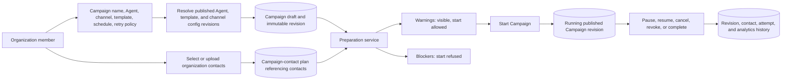
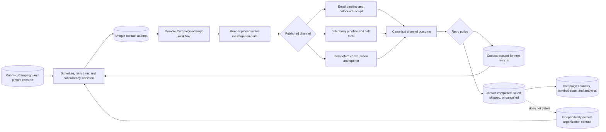

# Product data-flow atlas

Products compose several domain modules and pipelines into a complete
operator/contact outcome. This page contains one section per executable package
under `server/eylo/products/`. The current open-source tree has one product:
Campaigns.

The [pipeline data-flow atlas](pipeline-data-flows.md) documents the reusable
execution boundaries a product calls. Product diagrams instead show who owns
the definition, lifecycle, audience, and final result.

## Campaigns

### Definition, audience, and start

A Campaign is an organization-owned, revisioned outreach definition. Each
revision pins the Agent, template, channel config, scheduling policy, retry
policy, and concurrency limit. Campaign contacts reference organization
contacts; they do not take ownership of those contacts.

Sources: [`campaign_service.py`](../../server/eylo/products/campaigns/services/campaign_service.py),
[`preparation.py`](../../server/eylo/products/campaigns/preparation.py), and
[`controllers.py`](../../server/eylo/products/campaigns/controllers.py).

The start transition refuses deletion-pending contacts and other blockers.
Preparation warnings remain visible but do not implement conditional outreach
in V1.

### Per-contact execution and outcome

Periodic work files bounded per-contact attempts from a running Campaign.
Channel adapters compose the existing email, telephony, or conversation
pipelines. Each attempt has a stable identity so recovery can inspect a prior
effect before deciding whether another send is safe.

Sources: [`execution_service.py`](../../server/eylo/products/campaigns/services/execution_service.py),
[`channels`](../../server/eylo/products/campaigns/channels/),
[`outcomes.py`](../../server/eylo/products/campaigns/outcomes.py), and the
[`Campaign attempt pipeline`](pipeline-data-flows.md#campaign-attempt-pipeline).

Voice completion may arrive later through a durable call-outcome consumer.
Email and widget produce immediate canonical acceptance/outcome records. A
Campaign or call deletion never deletes the organization contact.
